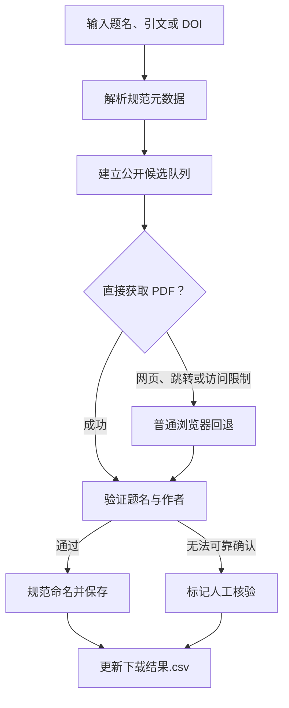

# 📚 Fetch Open Paper

> 输入论文题名或 DOI，把“**找公开版本、下载 PDF、核对论文、规范命名、记录结果**”交给 Codex。

这是一个面向 Codex 的论文检索与下载 Skill。它支持论文标题、完整引文、DOI、PMID 和 arXiv ID，可处理单篇论文，也可连续处理整批文献。

**公开来源 · 多版本兼容 · 题名与作者验证 · 批量任务可恢复**

---

## 💡 为什么做这个项目

很多论文其实已经在出版社、公共数据库、高校仓储或作者主页公开，但它们分散在不同平台。一个链接请求失败，也不代表论文没有公开版本——它可能只是落地页、JavaScript 跳转，或需要普通浏览器才能打开的下载入口。

批量找论文时，还容易遇到三个问题：**下载到错误文章、文件名混乱、任务中断后重复劳动**。

Fetch Open Paper 把这些步骤串成一个可恢复工作流：继续寻找多个合法公开候选，下载后核对题名与作者，只保存通过验证的 PDF，并用 CSV 留下完整记录。

---

## 🎯 它能做什么

- 🔎 **多种输入**：识别论文名、完整引文、DOI、PMID、arXiv ID。
- 🌐 **多源检索**：搜索出版社开放页面、PubMed Central、Europe PMC、arXiv、HAL、SSRN、Zenodo、高校仓储和作者主页等公开来源。
- 📄 **接受多种版本**：正式出版版、接受稿、作者稿、仓储副本和预印本均可；不会因为缺少正式版就直接失败。
- 🧭 **浏览器回退**：直接请求遇到 HTML、JavaScript 跳转或 HTTP 401/403 时，继续在普通浏览器中检查公开入口。
- ✅ **论文身份验证**：解析 PDF，并根据规范题名和作者姓氏核对论文。
- 🗂️ **批量任务可恢复**：持续更新 `下载结果.csv`，记录候选链接、来源、版本、尝试次数和结果。
- ✍️ **安全命名**：用规范论文题名命名 PDF；Windows 禁用字符统一替换为 `_`。

---

## 🚀 三步开始

### 1. 安装 Skill

直接在 Codex 中输入：

```text
请从 https://github.com/wrzhrjywjj-cmd/fetch-open-paper-skill 安装 fetch-open-paper skill
```

<details>
<summary><strong>查看手动安装方法</strong></summary>

1. 下载或克隆本仓库。
2. 将仓库内容放到：

   ```text
   C:\Users\<你的用户名>\.codex\skills\fetch-open-paper\
   ```

3. 确认 `SKILL.md` 直接位于上述目录中，没有额外嵌套一层仓库文件夹。
4. 重新启动 Codex，或重新加载技能列表。

</details>

> [!NOTE]
> 验证脚本需要 Python 3 和 `pypdf`。如环境中尚未安装，可运行 `python -m pip install pypdf`；普通 `python` 不可用时，Codex 可改用工作区内置 Python。

### 2. 第一次说明输出文件夹

```text
把论文下载到 JPSMpaper
```

当前任务只在**第一次**确定文件夹名称。此后的论文继续写入同一个目录，除非你明确要求更换。

### 3. 输入论文信息

```text
10.1001/jama.289.18.2387
```

也可以直接输入完整引文或一整批论文。

---

## 💬 你可以这样说

| 场景 | 示例 |
| --- | --- |
| DOI | `下载 10.1001/jama.289.18.2387` |
| 论文题名 | `下载 Patterns of functional decline at the end of life` |
| 完整引文 | `Lunney JR, Lynn J, Foley DJ, et al. ...` |
| 批量任务 | `请依次下载下面这些论文 PDF：1. ... 2. ... 3. ...` |
| 更换目录 | `后面的论文改存到 outputs\\NewFolder` |

---

## 🔄 它如何工作



候选来源的优先顺序：

1. **出版社公开 PDF 或开放文章页**；
2. **可信公共或学科仓储**；
3. **高校与机构仓储**；
4. **作者主页或明确授权的项目网站**。

一次失败不会立刻结束任务。Skill 会继续检查当前候选队列，并在可用时执行普通浏览器回退。

---

## 📁 输出长什么样

假设第一次指定文件夹为 `JPSMpaper`：

```text
outputs/
└── JPSMpaper/
    ├── Patterns of functional decline at the end of life.pdf
    ├── 另一篇论文题目.pdf
    └── 下载结果.csv
```

文件名中的 Windows 禁用字符及控制字符会替换为 `_`：

```text
< > : " / \ | ? *
```

---

## 🔬 PDF 如何验证

下载结果只有通过以下检查后，才会保存到目标目录：

- PDF 文件头与结构有效，且至少包含一页；
- 文件不超过 `100 MB` 的安全上限；
- PDF 元数据或前五页文本与规范题名匹配；
- 至少一位预期作者的姓氏出现在元数据或前五页中。

题名相似度默认阈值为 `0.80`。扫描版如果缺少可提取文字，只有在 PDF 元数据能够可靠确认题名与作者时才会自动通过，否则标记为 `需人工核验`。

> [!TIP]
> 成功结果统一报告为：`论文名称 — 已验证下载`。

---

## 📊 任务状态

| 状态 | 含义 |
| --- | --- |
| `待处理` | 已加入任务，尚未开始 |
| `直接下载中` | 正在尝试直接 PDF 地址 |
| `需浏览器尝试` | 直接请求得到网页、跳转或访问限制 |
| `浏览器下载中` | 正在普通浏览器中获取公开文件 |
| `已验证下载` | PDF 已下载，题名与作者验证通过 |
| `需人工核验` | PDF 可获得，但机器无法可靠确认身份 |
| `未完成下载` | 已穷尽当前合法公开候选，仍未完成 |

未完成的论文会返回论文名称，以及当前最佳的公开下载页或落地页链接。

---

## 🧰 手动使用脚本

通常不需要手动调用脚本，Skill 会自动完成这些步骤。

<details>
<summary><strong>下载并验证直接 PDF</strong></summary>

```powershell
python .\scripts\download_pdf.py `
  --url "<公开 PDF 地址>" `
  --title "<规范论文题名>" `
  --author "<作者姓氏>" `
  --output-dir ".\outputs\<文件夹名称>"
```

</details>

<details>
<summary><strong>验证浏览器下载的本地 PDF</strong></summary>

```powershell
python .\scripts\download_pdf.py `
  --file "<本地 PDF 路径>" `
  --title "<规范论文题名>" `
  --author "<作者姓氏>" `
  --output-dir ".\outputs\<文件夹名称>"
```

</details>

同一篇论文可以多次传入 `--author`。脚本只有在验证成功后才会复制、重命名并保存文件。

---

## 🛡️ 合规边界

> [!IMPORTANT]
> 本 Skill 只查找和下载**合法公开**的论文版本，不绕过验证码、登录、订阅、许可确认或付费墙。

不会使用 Sci-Hub、影子图书馆、泄漏副本或来源不明的转载站点。普通登录确有必要时，Skill 会请用户自行登录后再继续。

---

## 📦 仓库结构

```text
fetch-open-paper-skill/
├── SKILL.md
├── README.md
├── agents/
│   └── openai.yaml
└── scripts/
    ├── download_pdf.py
    └── update_manifest.py
```
